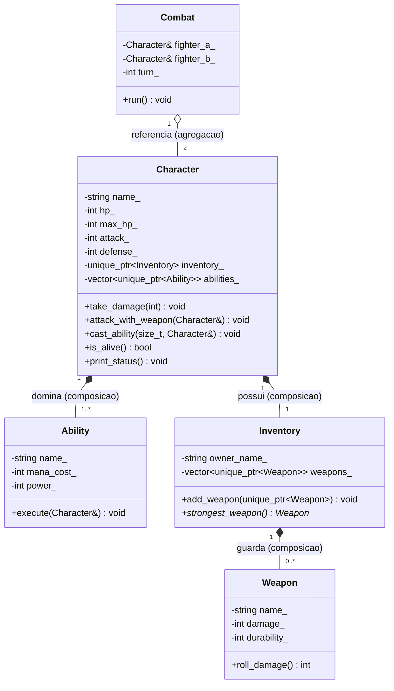

# Sistema de Combate RPG — TP1 POO 2026.1

**Aluno:** [NOME] — [MATRÍCULA]
**Disciplina:** POO 2026.1 — UFPB / Centro de Informática
**Professor:** Carlos Eduardo C. F. Batista

## Domínio

Sistema simplificado de combate RPG por turnos. Personagens possuem atributos (HP, ataque,
defesa), carregam um inventário com armas e dominam habilidades especiais. A classe `Combat`
referencia dois personagens e alterna turnos até que um caia — o vencedor é determinado pelo
sistema, e os personagens continuam existindo após o combate.

## Como compilar e rodar

```bash
cmake -B build -DCMAKE_BUILD_TYPE=Debug
cmake --build build
./build/rpg_combat
```

Requer CMake 3.20+, compilador C++17 (testado com Apple clang).

## Estrutura do projeto

```
project/
├── CMakeLists.txt
├── README.md
├── .gitignore
└── src/
    ├── main.cpp
    ├── weapon.hpp / weapon.cpp
    ├── ability.hpp / ability.cpp
    ├── inventory.hpp / inventory.cpp
    ├── character.hpp / character.cpp
    └── combat.hpp / combat.cpp
```

## Diagrama UML



> **Legenda:** `*--` representa composição (◆) e `o--` representa agregação (◇), seguindo a
> convenção do Mermaid.

## Composição e agregação

### Composições ◆

- **`Character → Inventory`**: o `Inventory` é criado no construtor do `Character` e destruído
  junto com ele. Sem o personagem, não existe inventário independente.
- **`Character → Ability`**: cada habilidade é específica do personagem que a aprendeu; não
  faz sentido uma `Ability` flutuando sem dono.
- **`Inventory → Weapon`**: as armas pertencem ao inventário. Quando o inventário é destruído,
  as armas vão junto. Nenhuma arma é compartilhada com outro inventário.

### Agregação ◇

- **`Combat → Character`**: o combate apenas **referencia** dois personagens que já existiam
  antes dele e continuam existindo depois. O destrutor de `Combat` **não** destrói os
  lutadores — isso é demonstrado na Cena 2 do `main()`, onde os personagens são usados após
  o `Combat` sair de escopo.

## Smart Pointers

| Membro / parâmetro | Tipo | Por quê |
|---|---|---|
| `Character::inventory_` | `std::unique_ptr<Inventory>` | Posse exclusiva: `Character` é o único dono do seu inventário. |
| `Character::abilities_` | `std::vector<std::unique_ptr<Ability>>` | Posse exclusiva de cada habilidade pelo personagem. |
| `Inventory::weapons_` | `std::vector<std::unique_ptr<Weapon>>` | Posse exclusiva de cada arma pelo inventário. |
| `Inventory::add_weapon(std::unique_ptr<Weapon>)` | `unique_ptr` por valor | Transferência explícita de posse via `std::move`. |
| `Inventory::strongest_weapon() const` | `Weapon*` (cru) | Observador **sem posse** — o vector continua sendo o dono. |
| `Combat::fighter_a_`, `Combat::fighter_b_` | `Character&` | Agregação: referência sem posse, como sugere o enunciado. |

Nenhum `delete` manual é usado no projeto. Não há `shared_ptr` porque nenhum recurso é
genuinamente compartilhado.

## Convenções de código

- `snake_case` em arquivos, funções e variáveis; `PascalCase` em classes.
- Membros privados com sufixo `_`.
- Identificadores em inglês; comentários em português.
- Construtores sempre com lista de inicialização.
- Getters `const`.
- `#pragma once` em todos os headers.
- Compilado com `-Wall -Wextra -Wpedantic`; AddressSanitizer e UBSan ativos em modo Debug.
